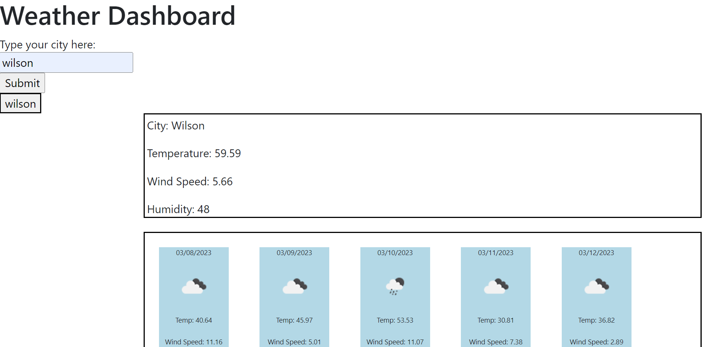

# weather-dashboard

This is a scheduler app developed for the UNC Coding Bootcamp

## Usage

Enter your city name and click submit. Click own you previously searched cites to retrieve weather data.

## Contributing

Pull requests are welcome. For major changes, please open an issue first
to discuss what you would like to change.

Please make sure to update tests as appropriate.

## Deployed Application

https://brandon5667.github.io/weather-dashboard/

## Screenshot

